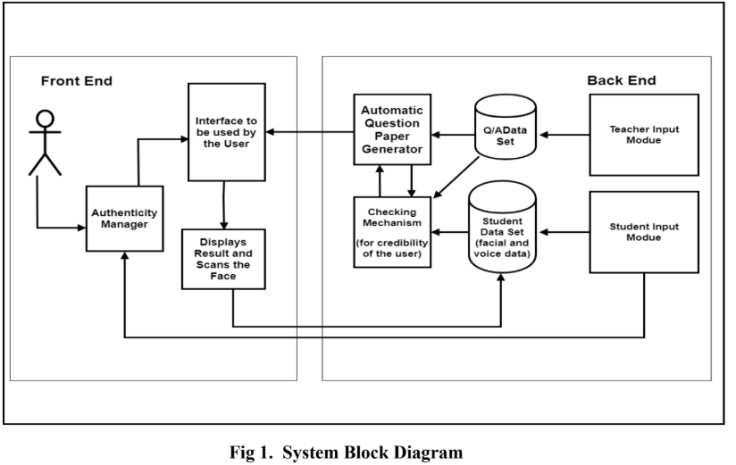
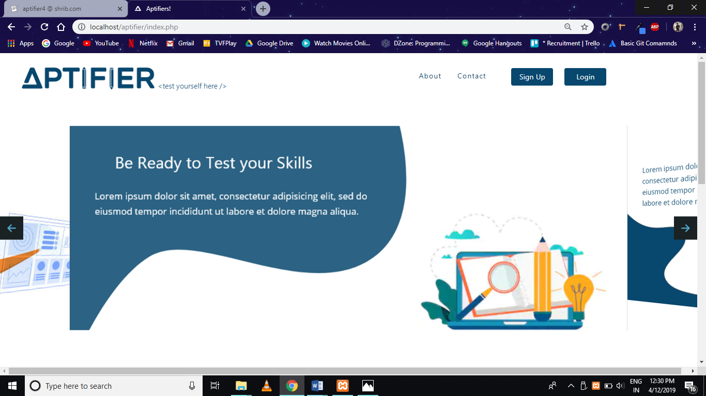
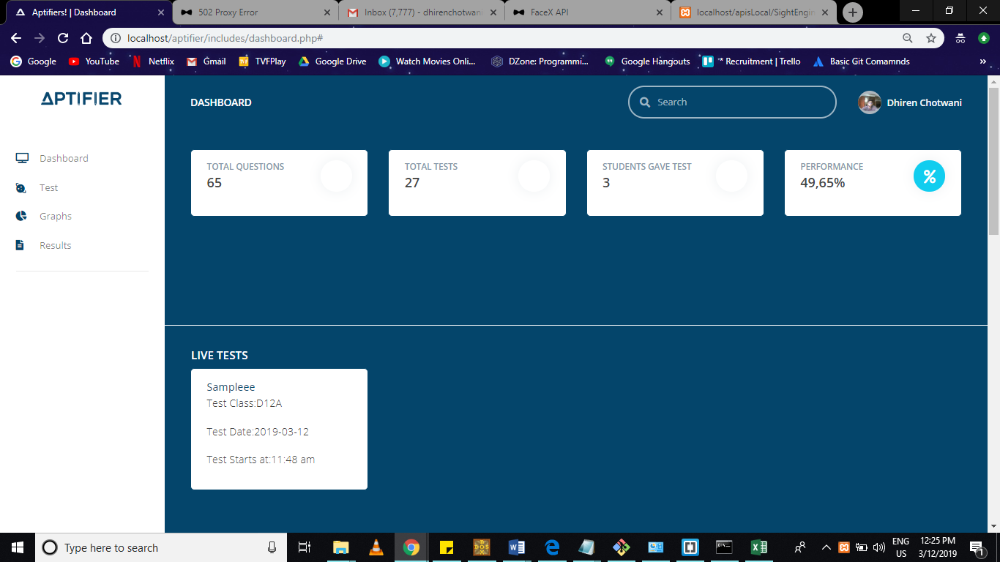
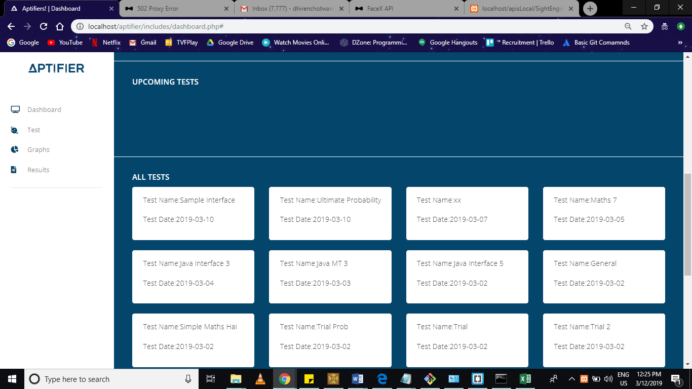
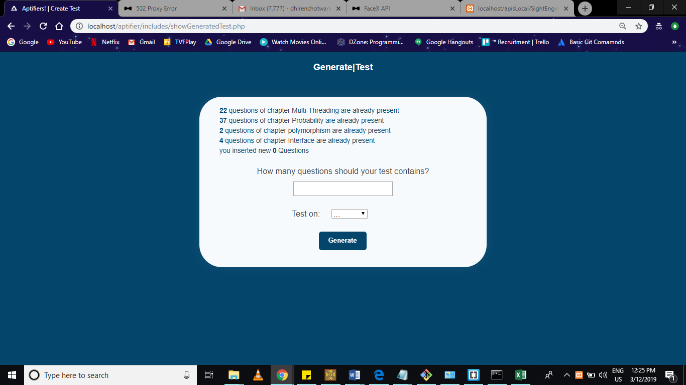
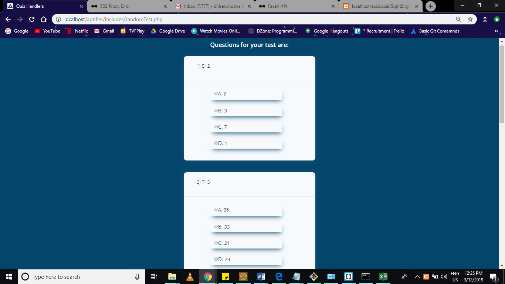

<b>APTIFIER</b>

<b>PROJECT DESCRIPTION</b>

More than 75% colleges conduct online tests for the students between there official term tests just to make
sure that the students are in touch with the terminologies and the concepts which are to be taught in different
lectures planned all around the semester duration. Most of these tests are conducted online either on the
official websites of these colleges or onto some online portal whereas our college uses Google forms to
conduct such tests. While conducting these tests there are a number of mishaps faced by the students and the
teachers as well. One major problem faced by the faculty is the process of retrieving data and the credibility
of the students appearing for the tests. We aim to work on these 2 broad areas for the project. We will
implement face recognition for ensuring that the expected student is giving the test . This particular software
will prevent cheating in these examinations, the overhead of using Google forms (once the data set is saved
it can be used until the syllabus is changed) and promote integrity, credibility, data retrieval and the
efficiency of conducting tests.

<b>FUNCTIONAL REQUIREMENTS</b>

➢ A fully function JavaScript-enabled web browser for the application to work with
libraries such as OpenCV, CV C++.

➢ Various frameworks for implementing Automatic Q/A paper generator like
Collection Framework, Bootstrap for website graphical components and
extensive knowledge about MySQL which will be the database technology to be used.

➢ For the hardware requirements, every device running the application must have
a web camera for facial recognition and mic support such as a port for earphones
or an external microphone (optional).

<b>NON-FUNCTIONAL REQUIREMENTS</b>

➢ The web application shall be easy to use by all employees of the system.

➢ The web application shall allow several operations (such as insertion, updating, etc.)
to be made at the same time without downgrading performance with the help of
web workers.

<b>CONSTRAINTS</b>

➢ This software will require face ID of every user which register to this portal.

➢ All the data set i.e. Questions which will be appearing in Multiple Choice Question test
will be inserted by the user (Teacher).

➢ Internet Access is required in order to handle all the API calls which are integrated with
the product.

➢ Due to the huge data collection cloud-based approach is set up for the product.

➢ A good Web camp is required to be integrated with the device on which the test is conducted.

➢ Good surrounding light is required in order to gain more efficient result from the software.

<b>BLOCK DIAGRAM</b>

<b>SCREENSHOTS OF USER INTERFACE</b>

1. Landing Page

2. Login Page

3. Student Dashboard

a. Live Tests

b. All Given Tests

c. Student Progress Graphs

d. Generate Test

e. Test

Note : The project includes many more features on student and teacher dashboard, above images is just a short glimpse of the project.

